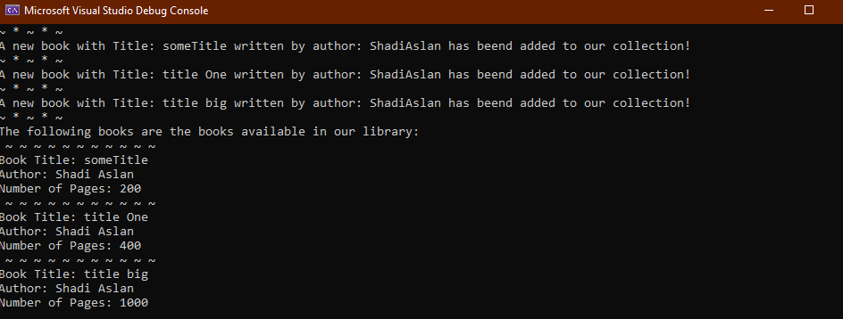

# Lab08: Collections

### Description

In this project, I create a library that holds books objects, a private dictionary & implemented the IEnumerator.

 
 

### Visual

 
 
### Tutorial
1. Download the Repositry to your local machine.
2. Run the application by clicking on the green play button or Control + F5.
3. Try the Add, Borrow and all the functionality present in the project.

 
 
### Extra details

Don't write WriteLine commands, each functionality has its own WriteLine command that shows if the process is complete in addition to additional information about the book.
 
 